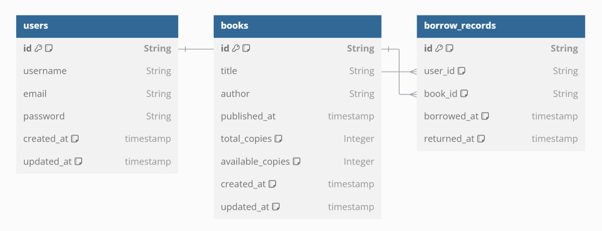

# Library Management

This project is a Library Management web application built using React for the frontend and Node.js/Express for the backend. It allows users to manage a collection of books, including features like borrowing, editing, adding, and deleting books.

---

## Features
- **User Authentication:** Secured routes with token-based authentication.
- **Search Functionality:** Search books by title or author in real-time.
- **Borrow Books:** Borrow a book and update its availability.
- **Add Books:** Add new books to the collection.
- **Edit Books:** Update details of existing books.
- **Delete Books:** Remove books from the collection.

---

## DB Diagram



## Installation

1. Clone the repository:
   ```bash
   git clone https://github.com/Sunnydeswal303/stock-tutor.git
   cd stock-tutor
   ```

2. Install dependencies for both frontend and backend:
   ```bash
   cd frontend
   npm install or npm install --legacy-peer-deps

   cd ../backend
   npm install or npm install --legacy-peer-deps
   ```

3. Start the frontend and backend servers:
   ```bash
   # Frontend
   cd frontend
   npm start or npm run start

   # Backend
   cd backend
   npm run start or npm run develop
   ```

4. Access the application at `http://localhost:3000`.

---

## Backend API Routes

### **Authentication Routes**

1. **Login**
   - **Endpoint:** `POST /api/users/login`
   - **Description:** Authenticates the user and returns a token.
   - **Request Body:**
     ```json
     {
       "email": "string",
       "password": "string"
     }
     ```
   - **Response:**
     ```json
     {
       "token": "string",
       "user": {
         "id": "string",
         "name": "string",
         "email": "string"
       }
     }
     ```

2. **Register**
   - **Endpoint:** `POST /api/users/register`
   - **Description:** Registers a new user.
   - **Request Body:**
     ```json
     {
       "fullname": "string",
       "username": "string",
       "email": "string",
       "password": "string"
     }
     ```

---

### **Books Routes**

1. **Get All Books**
   - **Endpoint:** `GET /api/books`
   - **Description:** Retrieves a list of all books.
   - **Headers:**
     ```json
     {
       "Authorization": "Bearer <token>"
     }
     ```
   - **Response:**
     ```json
     [
       {
         "id": "string",
         "title": "string",
         "author": "string",
         "publishedAt": "string",
         "totalCopies": number
       }
     ]
     ```

2. **Borrow a Book**
   - **Endpoint:** `POST /api/books/borrow`
   - **Description:** Borrow a book and reduce available copies.
   - **Request Body:**
     ```json
     {
       "bookId": "string"
     }
     ```
   - **Headers:**
     ```json
     {
       "Authorization": "Bearer <token>"
     }
     ```

3. **Add a Book**
   - **Endpoint:** `POST /api/books/add`
   - **Description:** Adds a new book to the collection.
   - **Request Body:**
     ```json
     {
       "title": "string",
       "author": "string",
       "publishedAt": "string",
       "totalCopies": number
     }
     ```
   - **Headers:**
     ```json
     {
       "Authorization": "Bearer <token>"
     }
     ```

4. **Edit a Book**
   - **Endpoint:** `PUT /api/books/:id`
   - **Description:** Updates details of an existing book.
   - **Request Params:**
     ```json
     {
       "id": "string"
     }
     ```
   - **Request Body:**
     ```json
     {
       "title": "string",
       "author": "string",
       "publishedAt": "string",
       "totalCopies": number
     }
     ```
   - **Headers:**
     ```json
     {
       "Authorization": "Bearer <token>"
     }
     ```

5. **Delete a Book**
   - **Endpoint:** `DELETE /api/books/:id`
   - **Description:** Deletes a book from the collection.
   - **Request Params:**
     ```json
     {
       "id": "string"
     }
     ```
   - **Headers:**
     ```json
     {
       "Authorization": "Bearer <token>"
     }
     ```

---

## Frontend Components

### **BooksDashboard**
- Displays a list of books with search, borrow, edit, add, and delete functionality.
- Includes modals for adding, editing, and deleting books.

### **Key Functionalities**
1. **Search Books:**
   - Filters books in real-time based on title or author.

2. **Borrow Books:**
   - Updates the availability of a book when borrowed.

3. **Add Books:**
   - Opens a modal to add new books to the list.

4. **Edit Books:**
   - Opens a modal to edit details of existing books.

5. **Delete Books:**
   - Confirms and deletes a book from the collection.

---

## Styling
- **Custom Buttons:** Each action button has unique styles for better UX.
- **Responsive Design:** Ensures proper display across various screen sizes.
- **Hover Effects:** Buttons have hover animations to improve interactivity.

---

## Tools & Libraries

### Frontend
- **React**: For building the user interface.
- **React Router**: For navigation.
- **React Toastify**: For notifications.

### Backend
- **Node.js**: Runtime environment.
- **Express.js**: For building RESTful APIs.
- **JWT**: For authentication.

### Database
- **MongoDB**: To store books and user data.

---

## Future Improvements
- Add user-specific borrowing history.
- Implement return book functionality.
- Enhance search filters (e.g., by published date).

---

## Author
Developed by Sunny

